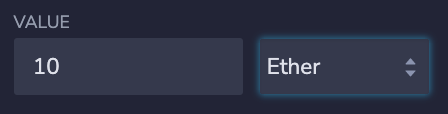

# Kasei Coin ICO • How to Puchase
Congratultions!  So you want to purchase Kasei Coin, eh?  Great choice.  Don't worry, it's totally not a rug pull, I promise.  Here are instructions with examples to help you make the purchase:

 

But First, a little background on how this was built....

 

----------------------

 

## Complie Contracts

Both solidity files for Kasei Coin and the Crowdsale compiled succesfully in Remix with no bugs.  
 

 

 

----------------------
 

## Deploy Contract
Once the contracts compiled, I deployed the `KaseiCoinCrowdsaleDeployer` contract to the Ethereum Network.  Below are the details associated with deploying the contacts.

 

 

Here the MetaMask wallet of the deploying address confirms the transcation and pays the gas fees.  Whoa, expensive!

 

 

Then I used the `KaseiCoinCrowdsaleDeployer` contract to deploy two more contracts: KaseiCoinCrowdsale and KaseiCoin.  The `KaseiCoin` contract is the contract for the actual coin itselft.  And the `KaseiCoinCrowdsale` contract allows user to buy the coin. 

 

 

All three contracts deployed:

 

----------------------

 

## Buy Tokens
Ok, now to the fun part... let's buy some tokens!  Use the `KaseiCoinCrowdsale` contract.  
1. In the 'value' section on the left side of remix, enter how much you want to spend in Ethereum.

2. Scroll down to the `KaseiCoinCrowdsale` and enter the wallet address you want to send the coins to. 

3. Click 'transact'

4. Metamask will pop up and ask you confirm you transcation.  Click Confirm.

### Kaboom, You are now the proud owner of Kasei Coin!

 

----------------------

 

## Confirm Token Balance

So now you own some Kasei Coin.  Sick!  But don't take my word for it.  You know what they say: "Don't trust, verify."

1. Navigate to your MetaMask wallet a click `Assets`.  This is where you can see all the coins and tokens in your wallet.  Don't see Kasei Coin?  Don't worry, we probably need to import the contract address.
2. In MetaMask, scroll down to `Import Tokens`
3. In the next window, copy the Kasei Coin contract address from Remix, and paste it in.  Then click 'Add Custom Token' and then click 'Import Tokens'

4. Shazam!  Now under aseets in your MetaMask wallet, you can see your Kasei Coin (ticker KAS) balance.  

 

----------------------

 

## Total Supply
Among many things, we can also check the total supply of Kasei Coins.  

In the left side of remix, navigate down to the `KaseiCoin` contract.  At the bottom of the options click the button `totalSupply`.  Right now, the total supply is 10,000,000,000,000,000,000 Wei.  This is equivelant to 10 Eth, which is the exact amount that we purchased in the example above. 
 

 

----------------------

 

## To the Moon!
Ok, now just hang on and hopefully this Kasei Rocket Ship goes to the moon. 
 

